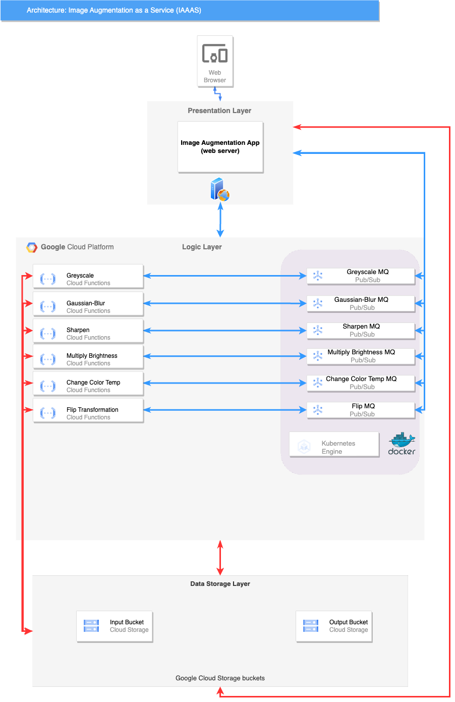

# Image Augmentation as a Service

### Description:
The goal of this project is to create an image augmentation service that allows users to upload an image and apply different augmentation types, such as blurring, grayscale, and changing brightness. These augmentations will be implemented as individual functions-as-a-service (FaaS), and the system will provide the user with a signed URL to download the augmented image from a bucket.

### Components:
1. Google Cloud Functions
2. Google Cloud Storage
3. Google Cloud Pub/Sub
4. Google Kubernetes Engine
5. Flask Rest Frontend

### Demo and Report:
- https://youtu.be/yx13ThY5ZUM?t=422
- https://drive.google.com/file/d/10hZj1TPXG0MNN9fW7oV2VdCH77fvPfns/view?usp=sharing

### Architecture:

